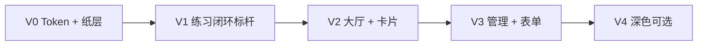

# iShua 视觉体验整体升级方案

> **文档性质**：在 `docs/design/ishua-ui-spec.md`（考纲手札终稿）基础上的 **视觉与交互深化方案**，不替代功能规格与路由 IA。  
> **日期**：2026-05-26  
> **状态**：已实施（分支 `feat/ui-visual-v1.1-paper`，V0–V3；V4 深色模式未做）  
> **关联**：`ishua-ui-spec.md`、`implementation-plan.md`、`src/styles/tokens.css`

---

## 1. 背景与目标

### 1.1 现状

P0–P9 功能与信息架构已基本落地，设计 token 与「考纲手札」概念（墨绿 + 暖米白 + 衬线标题）已在代码中体现。实际观感仍偏 **通用 SaaS / shadcn 默认语感**：大圆角白卡片、轻阴影、模糊光斑装饰、药丸形标签，纸感与「手札」记忆点未进入组件语法层。

### 1.2 升级目标

| 维度 | 目标 | 用户可感知结果 |
|------|------|----------------|
| **材质** | 亚触觉纸感：干燥、哑光、轻微颗粒 | 像写在道林纸上，而非悬浮白块 |
| **几何** | 干脆、小圆角、边线优先于阴影 | 界面更「利」，少「润」 |
| **交互** | 按下与翻页短、硬、可预期 | 按钮跟手；切题像翻页 |
| **气质** | 编辑室清爽 × 课堂笔记 | 专业刷题，非贴纸手帐、非 AI 模板站 |

### 1.3 非目标（本方案不做）

- 不改变 API、路由、权限与业务流（仍以 `ishua-ui-spec.md` 为准）。
- 不做重度 skeuomorphism（皮革、螺旋装订、胶带贴纸满屏）。
- 不引入新插画资产依赖（优先 CSS 纹理 + 现有 Logo）。
- 不阻塞功能迭代：采用 **token 先行 + 标杆页 + 分批扫组件**。

### 1.4 与终稿规格的关系

| 终稿保留 | 本方案调整 |
|----------|------------|
| 品牌概念「考纲手札」、墨绿主色、Slogan | 表面色略加深黄、减少纯白；`brand-muted` 使用场景收缩 |
| 刷题沉浸、解析批注式排版 | 强化 **单页纸** 与 **左边线批注**；选项交互改为「墨迹/尺线」 |
| 动效 150–250ms、`prefers-reduced-motion` | 细化为 **按下 80–120ms**、**翻页 180–220ms** 分 token |
| 首版无深色模式（终稿） | 列为 **Phase 4 可选**；若做则「台灯下暖纸」而非纯黑 OLED |

---

## 2. 问题诊断（为何显「AI 化」）

### 2.1 Token 层

当前 `src/styles/tokens.css`：

- `--bg-surface: #ffffff` 与画布对比形成 **漂浮卡片**。
- `--radius: 0.75rem` 全局偏圆。
- 边框 `#E5E2DC` 均匀，无纤维/压痕层次。

### 2.2 组件模式层（高频反模式）

| 模式 | 典型 class | 问题 |
|------|------------|------|
| 浮卡 | `rounded-2xl border bg-bg-surface shadow-sm` | 练习页、完成页、导入向导 |
| 软 hover | `hover:-translate-y-0.5 hover:shadow-md` | `BankCard` 等 |
| 装饰光斑 | `blur-3xl rounded-full bg-brand-muted` | `HomePage` Hero |
| 药丸标签 | `rounded-full bg-brand-muted` | 题型、进度标签 |
| 泛用字体 | 全站 Noto Sans SC | 标题衬线未形成系统层级 |

### 2.3 体验断层

终稿要求「解析如手札页边批注」，实现上多为 **圆角块 + 色底**，缺少 **纸页边距、尺线、翻页节奏**，概念与视觉未对齐。

---

## 3. 设计方向定稿：**「纸页研习」**

### 3.1 一句话

**课堂笔记的干脆 + 文库排版的清爽**；纸纹几乎看不见，但界面不再滑腻。

### 3.2 五条原则

1. **纸是表面，不是背景图** — 画布 = 纸堆色；内容区 = 略亮单页；避免大面积 `#FFF` 圆角浮层。
2. **干脆几何** — 圆角收到 4–6px；用 **1px 边线 / 底边投影** 代替 `shadow-sm`。
3. **墨色层次** — 主文暖黑墨水；品牌色作 **印章/荧光笔** 少量点缀。
4. **节奏像行距** — 练习区可选淡横线；列表页像 **目录**，不堆独立 widget 卡。
5. **手写仅点缀** — 完成页/空状态最多一处装饰字；选项与按钮保持高可读无衬线。

### 3.3 推荐主配方：**编辑室清爽（A）+ 练习区横线（B 局部）**

| 区域 | 纸感 | 交互 |
|------|------|------|
| 全站画布 | 全局 2%–4% 噪点 + 米白底，**无横线** | — |
| 练习/错题刷题 | 题目容器：淡横线 + 可选左侧订线 | 翻页 slide 200ms；选项左边线选中 |
| 大厅/题库列表 | 干净纸色，索引条式卡片 | 卡片无 hover 上浮 |
| 表单/Dialog | 浅框或下划线输入 | 按钮 active 下沉 1px |

---

## 4. 设计系统升级（Token 草案）

> 实施时写入 `src/styles/tokens.css`，并与 Tailwind `@theme inline` 同步。以下为 **建议值**，落地前用对比度工具抽检 WCAG AA。

### 4.1 色彩

| Token | 当前 | 建议 | 说明 |
|-------|------|------|------|
| `bg-canvas` | `#F7F5F0` | `#EDE8DF` ~ `#F0EBE3` | 略深、略黄，书桌纸堆 |
| `bg-surface` | `#FFFFFF` | `#F7F4EC` | 卡片/面板，**非纯白** |
| `bg-sheet` | —（新增） | `#FFFEF9` | 练习「单页」专用 |
| `text-primary` | `#1A1A1A` | `#1A1814` | 暖黑墨水 |
| `text-secondary` | `#5C5C5C` | `#5C564C` | 铅笔灰 |
| `border` | `#E5E2DC` | `#D4CFC4` | 尺线/折痕感 |
| `brand` | `#2D6A4F` | **保留** | 与终稿一致 |
| `brand-muted` | `#E8F0EC` | 使用 **收缩** | 仅进度、轻提示；选项选中改用左边线 |

### 4.2 圆角

| Token | 当前 | 建议 |
|-------|------|------|
| `--radius` | `0.75rem` | `0.25rem`（4px）为默认 |
| `--radius-lg` | — | `0.375rem`（6px）练习卡片上限 |
| Logo / 头像 | `rounded-2xl` | `rounded-md` 或方角 + 1px 边 |

### 4.3 阴影（改为「贴桌」）

```css
/* 建议语义 token */
--shadow-paper: 0 1px 0 rgba(26, 24, 20, 0.06);
--shadow-pressed: inset 0 1px 2px rgba(26, 24, 20, 0.08);
```

- 默认组件：**无** `shadow-sm`，或仅 `shadow-paper` 底边。
- **禁止** 营销式 `blur-3xl` 光斑（`HomePage` Hero 等）。

### 4.4 动效 Token（新增）

```css
--motion-press: 100ms cubic-bezier(0.2, 0, 0, 1);
--motion-page: 200ms cubic-bezier(0.2, 0, 0, 1);
--motion-expand: 220ms cubic-bezier(0.2, 0, 0, 1); /* 解析展开 */
--motion-stagger: 35ms; /* 完成页统计 */
```

| 场景 | 时长 | 属性 |
|------|------|------|
| 按钮 `active` | 80–120ms | `translateY(1px)` + 边框/背景 |
| 切题 | 180–220ms | `translateX(8–12px)` + `opacity` |
| 解析展开 | 200–250ms | `height`/`grid` 优先用 `opacity`+`transform` 若可 |
| `reduce` | 0–1 帧 | 仅颜色/边框变化 |

### 4.5 字体（分阶段）

| 阶段 | UI / 正文 | 标题 | 装饰 |
|------|-----------|------|------|
| **Phase 1** | 保留 Noto Sans SC，收紧字重层级 | Noto Serif SC 扩大使用范围（页面 h1、h2） | 无 |
| **Phase 2** | 评估 **IBM Plex Sans SC** 或 **思源黑体** 二选一 | 霞鹜文楷 / Source Serif 4 | 完成页一句手写体（可选） |

终稿 Web 字体策略保留：`font-display: swap`；新增字体须评估包体与 FCP。

### 4.6 纸质纹理（CSS 系统）

**三层结构（全站一层，练习区加强）：**

```
L0: background-color: var(--bg-canvas)
L1: 噪点（SVG feTurbulence 或 repeating-gradient，opacity 2%–4%，mix-blend-mode: multiply）
L2: 横线（仅 .paper-sheet，repeating-linear-gradient，opacity 3%–5%）
```

**约束：**

- `line-height` 必须与横线 `background-size` 步长一致（见 [CSS-Tricks Notebook](https://css-tricks.com/how-to-create-a-notebook-design-with-css/)）。
- 纹理 **不动画**；动效只动 `transform` / `opacity`。
- 提供 `.paper-plain`（无横线）与 `.paper-ruled`（有横线）两个 utility class。

**可选依赖调研：** `@sanbira/binder-paper-css`（订线+打孔+横线）— 仅练习容器引用，避免全局污染。

---

## 5. 组件与页面改造清单

### 5.1 优先级矩阵

| 优先级 | 范围 | 理由 |
|--------|------|------|
| **P0** | `tokens.css`、`index.css` 纸层、Button 按下态 | 全局杠杆 |
| **P0** | `PracticePlayer`、`WrongPracticePlayer`、`GuestPracticePage` | 核心刷题体验 |
| **P0** | `PracticeComplete` | 高情感触点 |
| **P1** | `HomePage`、`BankCard`、`AppShell` | 大厅第一印象 |
| **P1** | `EmptyState`、`ErrorState`、`PracticeToast` | 状态一致性 |
| **P2** | `ImportWizard`、表单页、`dialog`/`input` | 管理流 |
| **P2** | 其余列表页（`MyBanksPage`、`WrongQuestionList` 等） | 批量替换 class |
| **P3** | 深色模式（若产品批准） | 终稿原排除项 |

### 5.2 标杆组件规格

#### 练习单页（`.paper-sheet`）

```
结构：
  [顶栏：题库名 + 题号尺线]
  [题干区]
  [选项列表 — 非圆角大块]
  [底栏：上一题 / 提交 / 下一题]

样式要点：
  - 容器：bg-sheet、border、radius-lg(6px)、paper-ruled
  - 选项默认：1px border；hover：边框加深
  - 选项选中：border-left 3px brand + bg 略深一度（非 brand-muted 满铺）
  - 选项 active：translate-y-px
解析区：
  - 左侧 3px brand 竖线（终稿已有方向）
  - 展开 animation: --motion-expand
```

#### 主按钮（`Button` default）

```
默认：bg-brand、shadow-paper（底边）
hover：bg-brand-hover（无 translate）
active：translate-y-px、shadow-none 或 shadow-pressed
focus-visible：2px 实线 offset（少用大 ring 光晕）
```

#### 题库卡片（`BankCard`）

```
由「浮卡」改为「索引条」：
  - 左侧 4px brand 色条（或灰条表示非活跃）
  - rounded-md、无 hover 上浮
  - 标题 font-serif；描述 text-secondary
```

#### 大厅 Hero（`HomePage`）

```
移除：blur-3xl 光斑
改为：静态尺线/角标/页码式排版（编辑室）
```

### 5.3 文件级影响面（预估）

| 文件/目录 | 改动类型 |
|-----------|----------|
| `src/styles/tokens.css` | Token 新增与替换 |
| `src/index.css` | 纸层 utility、字体 import |
| `src/components/ui/button.tsx` | active 态、variant 微调 |
| `src/components/PracticePlayer.tsx` | 结构 class 重命名 |
| `src/components/WrongPracticePlayer.tsx` | 同上 |
| `src/pages/GuestPracticePage.tsx` | 与 PracticePlayer 对齐 |
| `src/components/PracticeComplete.tsx` | 完成页版式 |
| `src/pages/HomePage.tsx` | Hero |
| `src/components/BankCard.tsx` | 卡片语义 |
| `src/layouts/AppShell.tsx` | 壳层背景/边线 |
| 其余 `rounded-2xl` + `shadow-sm` grep 批量替换 | 机械但需目视回归 |

建议用 ripgrep：`rounded-2xl|shadow-sm|blur-3xl|hover:-translate` 做改造跟踪。

---

## 6. 动效与翻页（实现指引）

### 6.1 切题动画

- **推荐**：题目容器 `key={question.id}` + CSS transition 或 Framer Motion `AnimatePresence`，`mode="wait"`，`duration: 0.2`。
- **方向**：下一题 `translateX(12px) → 0`；上一题反向。
- **背景**：画布/纸纹 **不动**，仅中间 sheet 动 — 模拟抽换纸张。

### 6.2 路由级过渡

- 大厅 ↔ 练习：**无动画** 或 opacity 150ms（避免与切题叠加眩晕）。
- 练习 → 完成页：短 slide-up 200ms 或静态 + 统计 stagger。

### 6.3 无障碍

- 遵守现有 `@media (prefers-reduced-motion: reduce)`（`tokens.css` 已存在），动效降为 instant。
- 纹理保留静态色，避免闪烁噪点动画。

---

## 7. 外部参考索引

| 类型 | 链接 | 用途 |
|------|------|------|
| React 纸质组件库 | https://kwhittenberger.github.io/papernote-ui/ | 组件结构与 muted 色 |
| shadcn Notebook 主题 | https://www.shadcn.io/theme/notebook | OKLCH 纸墨配色 |
| 横线+订线 CSS | https://www.npmjs.com/package/@sanbira/binder-paper-css | 练习区规则纸 |
| 横线对齐教程 | https://css-tricks.com/how-to-create-a-notebook-design-with-css/ | line-height 与 gradient |
| 品牌纸感 | https://thehobonichi.com/ | 克制排版参考 |
| 奶油编辑风 | https://robertbirming.com/bearful-bear-theme/ | 阅读型 contrast |

---

## 8. 分阶段实施计划

与 `implementation-plan.md` **并行**，不插入 P0–P9 功能依赖链；建议单独里程碑 **V1.1 视觉**。



| 阶段 | 交付物 | 验收 |
|------|--------|------|
| **V0**（1–2 天） | 新 token、纸层 utility、Button active、去掉 Hero blur | 全站底色统一；按钮按下可见下沉 |
| **V1**（3–5 天） | Practice 三件套 + Complete + 切题动效 | 刷题 10 题不晕；选项选中为左边线；纸纹不抢字 |
| **V2**（2–3 天） | Home、BankCard、AppShell、Empty/Error | 大厅无 SaaS 浮卡感；卡片无 hover 跳 |
| **V3**（3–4 天） | Import、登录注册、Dialog/Input | 表单与练习视觉一致 |
| **V4**（可选） | 深色「台灯纸」token + 截图回归 | 对比度 AA；与终稿产品决策同步 |

每阶段结束：**375px 手机 + 1280 桌面** 截图存档；`npm run build` 通过。

---

## 9. 验收标准（Definition of Done）

### 9.1 视觉

- [ ] 全站无大面积 `#FFFFFF` 圆角浮卡（练习页、完成页优先）。
- [ ] 无 `blur-3xl` 装饰光斑。
- [ ] 正文对比度 ≥ 4.5:1（WebAIM 或浏览器审计）。
- [ ] 纸纹在 100% 缩放下不干扰阅读（团队 3 人盲测）。

### 9.2 交互

- [ ] 主按钮与选项 `active` 反馈 ≤ 120ms。
- [ ] 切题动画 180–220ms，可连切 10 题不主动关闭动效者不晕。
- [ ] `prefers-reduced-motion` 下功能无损。

### 9.3 工程

- [ ] Token 单一来源 `tokens.css`，无组件内硬编码 hex（除题型标签等例外登记）。
- [ ] 更新 `ishua-ui-spec.md` 第 4 节色板与圆角（实施完成后）。
- [ ] 关键路径 E2E/手动用例：访客刷题、登录刷题、完成页、大厅列表。

### 9.4 反模式检查（回归时禁止回潮）

- [ ] 无 `hover:-translate-y-*`  on 卡片
- [ ] 无练习选项 `rounded-full` 药丸底
- [ ] 无 `transition: all 300ms` 泛用缓动

---

## 10. 风险与对策

| 风险 | 对策 |
|------|------|
| 纸纹导致性能下降 | 单层静态 CSS；禁止动画 background-position |
| 横线与字号不对齐 | 固定 `--line-height` 与 `background-size` 联动 token |
| 与终稿「无深色」冲突 | V4 单独立项评审 |
| 字体更换 FCP 变差 | Phase 2 再换；子集化 woff2 |
| 批量 class 替换遗漏 | CI 可加 grep 规则（可选） |

---

## 11. 文档维护

| 事件 | 动作 |
|------|------|
| V0 合并 | 在 `ishua-ui-spec.md` §4 增加「2026-05 V1.1 视觉」修订记录 |
| V1 完成 | 补充练习页截图至 `docs/design/`（可选） |
| 产品否决某项 | 在本文件 §3.3 标注 **已裁剪** 及原因 |

---

## 12. 总结

本次升级 **不改变 iShua 的产品定义**，而是把已有「考纲手札」从 **文案概念** 推进到 **可执行的视觉语法**：哑光纸面、小圆角、边线优先、短动效、练习区规则纸。优先 **练习闭环** 做标杆，再扫大厅与管理页，可避免大面积返工同时最快验证「粗糙纸感 + 干脆交互」是否成立。

**下一步建议**：评审 §4 Token 草案 → 批准 V0–V1 排期 → 在 Agent/人工 PR 中先改 `tokens.css` + `PracticePlayer` 做可点击原型。
