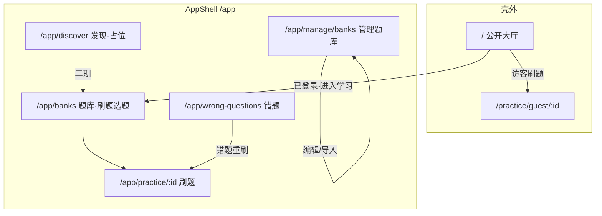

# 入口与题库信息架构 — 粗颗粒度方案

> **版本**：0.3 · 2026-05-21  
> **状态**：已实施（代码 `5152e20`；文档 S4 已同步）  
> **依据**：`docs/known-gaps.md`、`docs/implementation-plan.md`、`docs/design/ishua-ui-spec.md`、`docs/design/atlas-ui-design-draft.md` 及当前 `src/router.tsx`、`AppShell`、`HomePage`、`MyBanksPage` 实现。

---

## 1. 背景与问题陈述

当前产品存在 **两套壳层**：根路径 `/` 为无 `AppShell` 的公开大厅；`/app/*` 为登录后的业务壳（侧栏/底栏）。游客默认进 `/` 合理。已登录用户在使用中暴露出三类 **入口语义错位**：

| # | 现象 | 根因（粗判） |
|---|------|----------------|
| **P1** | 已登录用户停在主界面 `/` 时，难以进入 `/app` 学习区 | 大厅在 `AppShell` 外；已登录顶栏仅昵称+退出，无「进入应用」；`USER` 登录默认落地即为 `/` |
| **P2** | App 内导航「发现」指向 `/`（公开大厅） | 实现按早期规格「发现 → 大厅」；用户在 App 内期望「发现」= 在壳层内浏览/选题刷题，而非跳出 App |
| **P3** | 侧栏/底栏「我的题库」(`/app/banks`) 实为建库、改库、删库 | 路由与文案绑定 `MyBanksPage` + `pageMyBanks` 管理流；用户期望「我的题库」= 按公共/私有分类的 **刷题选题**；管理应独立为「管理题库」 |

本方案只做 **信息架构（IA）与路由/导航层面的粗切分**，不展开组件级实现细节。

---

## 2. 现状摘要（便于对齐）

### 2.1 路由与默认落地

```text
/                     → HomePage（公开题库列表，无 AppShell）
/app                  → index 重定向到 /app/wrong-questions
/app/banks            → MyBanksPage（PREMIUM+ 管理：新建/编辑/删除）
/app/banks/:bankId    → 详情、试题、AI 导入（管理流）
/app/practice/:id     → 刷题（沉浸，无底栏）
/app/wrong-questions  → 错题本
```

- 登录落地：`PREMIUM+` → `/app/banks`；`USER` → `/`（`LoginPage.getDefaultLanding`）。
- App 侧栏「发现」：`APP_SIDEBAR_NAV[0].to === "/"`（`src/lib/appNavigation.ts`）。

### 2.2 页面职责错位（P3 核心）

| 路径 | 当前主职责 | 用户心智 |
|------|------------|----------|
| `/` | 公开题库浏览 + 刷题入口 | 访客大厅 ✓；登录用户缺 App 入口 |
| `/app/banks` | **管理**自有题库（`pageMyBanks`、Drawer、删库） | 误以为是 **刷题选题**（公共+私有） |
| `BankCard` `owned` 变体 | 主按钮「管理题库」，次按钮「刷题」 | 卡片上已有语义分离，但导航仍叫「我的题库」 |

设计稿 `atlas-ui-design-draft.md` §3 导航分组其实已区分 **发现（大厅）**、**学习（刷题）**、**管理（我的题库 CRUD）**，但实现把「发现」与大厅 URL 绑死，且把管理页命名为「我的题库」。

---

## 3. 目标信息架构（原则）

1. **壳层清晰**：`/app` 内日常闭环为 **题库选题 → 刷题 → 错题**；`/` 为 **品牌/访客大厅**，App Tab 不指向 `/`。
2. **文案 = 行为**：「发现」为 App 内独立 Tab（首版占位）；「管理题库」= CRUD/试题/导入；「题库」= **刷题选题**（公共 + 私有 Tab）。
3. **角色分层不变**：刷题 `USER+`；管理 `PREMIUM+`；ADMIN 管理占位独立。不新增 Dashboard。
4. **路径一刀切**：管理子路由迁至 `/app/manage/banks/*`；**不保留**旧 `/app/banks/:bankId` 等重定向（评审结论 2026-05-21）。

---

## 3.1 已确认决策（2026-05-21）

| # | 决策 |
|---|------|
| 1 | **发现**与**题库**双路由并存；`/app/discover` 首版为**占位页**（待开发），具体能力二期再做。 |
| 2 | 与 #1 联动：移动底栏仍保留「发现」+「题库」两项；首版日常选题以**题库页**为主，发现 Tab 仅占位、不承载列表/刷题。 |
| 3 | 管理路由 **`/app/manage/banks`**（含 `:bankId` 子路由）；**旧路径不保留**（无 `Navigate` 兼容）。 |
| 4 | 刷题选题页 **`/app/banks`**（公共 \| 私有 Tab，以刷题为主）。 |
| 5–6 | `USER` / `PREMIUM+` 登录默认落地均为 **`/app/banks`**。 |
| 7 | 大厅已登录：主 CTA **「进入学习」** → `/app/banks`；昵称区为**下拉**（用户资料占位、退出等账号操作）。 |
| 8 | 已登录访问 `/` **不强制**跳转 `/app`。 |
| 9 | 导航文案第三项缩短为 **「题库」**（非「我的题库」）。 |
| 10 | 侧栏新增 **「管理题库」** → `/app/manage/banks`（`PREMIUM+`；`USER` 不展示或点选走 Upgrade，与现网 PREMIUM 项一致）。 |
| 11–12 | **`USER` 可见并可进入题库页**；公共 Tab 可用；**私有 Tab 置灰**，点击弹出 **UpgradePrompt**（不隐藏 Tab）。 |
| 13 | 与 #1 联动：发现占位页**不提供**建库/列表/刷题；上述能力仅在题库页与管理页。 |

---

## 4. 粗颗粒度方案（按已确认决策修订）

### 4.1 P1 — 已登录用户从主界面进入 App

**目标**：在 `/` 不剥夺访客体验的前提下，让已登录用户 **始终有显式入口** 进入 `/app` 内 **题库页**。

| 层级 | 已确认 |
|------|--------|
| **大厅 `/`（已登录）** | 主按钮 **「进入学习」** → `/app/banks`。昵称区 **下拉菜单**：用户资料（占位）、退出等；不再仅用平铺「昵称 + 退出」。 |
| **登录默认落地** | `USER` / `PREMIUM+` / `ADMIN`（无 `redirect` 时）→ **`/app/banks`**。 |
| **可选增强（二期）** | 「记住上次 Tab」本地存储；首版可不做。 |

**不采用**：已登录访问 `/` 强制重定向到 `/app`。

---

### 4.2 P2 — App 内「发现」语义修正

**目标**：AppShell 中「发现」不再指向 `/`，而是 **App 内路由**；首版 **不实现具体业务**，为二期预留。

| 项 | 已确认 |
|----|--------|
| **新路由** | `/app/discover` — `AppShell` 包裹的 **占位页**（如「发现功能开发中」+ 可选链到 `/app/banks`）。 |
| **导航** | 侧栏/底栏第一项「发现」：`to: "/app/discover"`；**不**再指向 `/`。 |
| **首版内容** | **无**公共/私有题库列表、无刷题 CTA、无「新建题库」（与题库页、管理页职责分离，见决策 #13）。 |
| **二期方向** | 探索/推荐/运营位等（实施时再写细规格）；与 `/app/banks` 并存，不合并。 |
| **`/` 大厅定位** | 访客主入口 + 已登录可手动访问；**不作为** App Tab 目标。 |
| **`/app` index** | 重定向 **`/app/banks`**（默认学习入口为题库，非发现占位页）。 |

**与规格的关系**：更新 `ishua-ui-spec.md` §5.2、§6.1 — 发现为 `/app/discover` 占位；大厅 CTA 与登录落地指向 `/app/banks`。

---

### 4.3 P3 — 「我的题库」与「管理题库」职责拆分

**目标**：刷题选题与管理 CRUD 使用 **不同路由与导航项**。

#### 4.3.1 路由重划（推荐）

```text
/app/discover              → 发现（首版占位，待开发）                    [USER+]
/app/banks                 → 题库（刷题选题；Tab：公共 | 私有）          [USER+]
/app/manage/banks          → 管理题库（原 MyBanksPage 列表）            [PREMIUM+]
/app/manage/banks/:bankId  → 详情、试题、导入（原 /app/banks/* 子路由）
/app/practice/:bankId      → 不变
```

**说明**：

- **`/app/banks`**：以 **刷题选题** 为中心；Tab「公共」= `pagePublicBanks`；Tab「私有」= `pageMyBanks` 私有库（`PREMIUM+` 可刷）。`USER` 可进页，私有 Tab **置灰**，点击 **UpgradePrompt**。无删库/Drawer/新建主流程。
- **`/app/manage/banks`**：承接现 `/app/banks` 管理实现；侧栏独立项「管理题库」。
- **兼容**：**不保留**旧 `/app/banks/:bankId` 等路径；实施时全局替换链路与文案（书签会 404，评审已接受）。

#### 4.3.2 导航文案调整（AppShell）

| 顺序 | 现文案 → 路径 | 已确认文案 → 路径 |
|------|----------------|-------------------|
| 1 | 发现 → `/` | 发现 → `/app/discover`（占位） |
| 2 | 错题本 → `/app/wrong-questions` | 不变 |
| 3 | 我的题库 → `/app/banks` | **题库** → `/app/banks`（`USER+`，见 §4.3.3） |
| 4 | 管理（ADMIN） | **管理题库** → `/app/manage/banks`（`PREMIUM+`） |
| 5 | — | **用户管理** → `/app/admin/users`（仅 `ADMIN`） |

移动底栏：发现、错题、**题库**、我的（Sheet）；**管理题库**首版以 **桌面侧栏第 4 项** 为主（`PREMIUM+`），移动端可在「我的」Sheet 增链作为补充（实施时二选一或并存，不阻塞 S1）。

#### 4.3.3 角色与 Upgrade 行为

| 能力 | USER | PREMIUM+ |
|------|------|----------|
| `/app/discover` | ✓ 占位页 | ✓ 占位页 |
| `/app/banks` 页面进入 | ✓ | ✓ |
| `/app/banks` 公共 Tab | ✓ | ✓ |
| `/app/banks` 私有 Tab | 置灰，点击 UpgradePrompt | ✓ 可刷私有库 |
| `/app/manage/banks` | 侧栏不可见或 Upgrade | ✓ |

`RoleGate` 挂在 `/app/manage/banks` 子树；`/app/banks`、`/app/discover` 仅 `AppShell` 登录守卫（`USER+`）。

---

## 5. 用户路径（修正后示意）



---

## 6. 实施阶段建议（粗颗粒度）

| 阶段 | 范围 | 验收要点 |
|------|------|----------|
| **S1 — 路由与导航** | 新增 `/app/discover` 占位；`/app/manage/banks` 迁移子路由（**无**旧路径重定向）；改 `appNavigation`、router index → `/app/banks` | ✅ `5152e20` |
| **S2 — 页面拆分** | `PracticeBanksPage`；管理页改标题/文案；`BankCard` 场景区分 | ✅ `5152e20` |
| **S3 — 大厅与登录落地** | `HomePage` CTA；`LoginPage` 默认落地；管理页返回链 | ✅ `5152e20` |
| **S4 — 文档与清理** | 同步 `ishua-ui-spec`、`atlas-ui-design-draft`、`known-gaps`、`README` | ✅ 2026-05-21 已完成 |

**不在本方案首期**：Dashboard、后端新 API（若私有库筛选仅靠前端过滤即可先做）、E2E（见 `known-gaps` 跨阶段项）。

---

## 7. 需同步的文档清单

| 文档 | 变更要点 |
|------|----------|
| `docs/design/ishua-ui-spec.md` | §5.1 路由表增 `/app/discover`、`/app/manage/banks`；§5.2 导航表；§6.1 大厅已登录 CTA |
| `docs/design/atlas-ui-design-draft.md` | §0.4、§3 IA 图、导航分组表 |
| `docs/implementation-plan.md` | P5/P6 验收项与路径描述 |
| `docs/known-gaps.md` | 可新增「导航 IA 重构」跟踪项；P2 USER 默认落地条目在实施后关闭 |
| `README.md` | 角色能力表路径一句带过 |

---

## 8. 风险与实施注意

| 项 | 说明 |
|----|------|
| **发现 Tab 首版空** | 用户可能点「发现」仅见占位；占位页应提供明确文案 + 引导至「题库」。 |
| **不保留旧路径** | 外链/书签 `/app/banks/:bankId` 将失效；实施前检查 README、测试脚本、返回链。 |
| **`BankCard` `detailPath`** | 现 `owned` 变体链到 `/app/banks/:id`，需改为 `/app/manage/banks/:id`。 |
| **大厅下拉 vs App「我的」Sheet** | 规格 §6.1 与 App 移动 Sheet 职责略重叠；首版大厅下拉做账号，学习入口仍以 CTA 为主。 |

---

## 9. 成功标准（方案级）

- [x] 已登录用户在 `/` 一次点击「进入学习」即可进入 `/app/banks`。
- [x] App 内点击「发现」不离开 `AppShell`（首版为占位，不承载管理后台）。
- [x] 「管理题库」路径下保留现有 CRUD/详情/导入能力；「题库」路径以 **公共/私有刷题选题** 为主，无删库主流程。
- [x] 设计规格与 `appNavigation`、router 一致（`ishua-ui-spec` §5、`atlas` §0.4/§3 已更新）。

---

## 10. 相关代码锚点（实施时参考）

| 文件 | 关联 |
|------|------|
| `src/router.tsx` | 路由树、index 重定向、`RoleGate` 挂载位置 |
| `src/lib/appNavigation.ts` | 侧栏项 `to` / `label` |
| `src/layouts/AppShell.tsx` | 移动底栏、`ProfileSheet` 管理题库链 |
| `src/pages/DiscoverPage.tsx` | 发现占位 |
| `src/pages/PracticeBanksPage.tsx` | 题库刷题选题 |
| `src/components/LobbyAccountMenu.tsx` | 大厅「进入学习」+ 昵称下拉 |
| `src/pages/HomePage.tsx` | 已登录顶栏 |
| `src/pages/MyBanksPage.tsx` | 管理列表 → 迁至 manage |
| `src/pages/LoginPage.tsx` | `getDefaultLanding` |
| `src/components/BankCard.tsx` | `lobby` / `owned` 变体 |

---

*决策来源：`docs/temp/temp.md`（2026-05-21）。实施以本文 §3.1 为准。*
