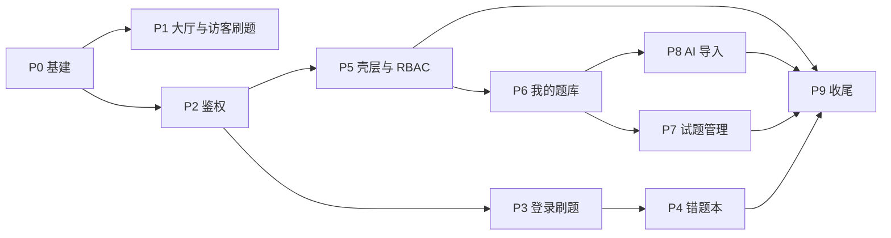

# iShua 前端分步执行方案

> **目的**：将 `docs/design/ishua-ui-spec.md` 拆解为可独立交付、可联调、可验收的实施阶段。  
> **API**：`api-docs-v3.json`（仓库根目录）  
> **设计粗稿**：`docs/design/atlas-ui-design-draft.md`（只读参考，实施以终稿为准）

**当前进度（2026-05-20）**：**P0–P8 已落地**（AI 导入四步向导）；下一步 **P9 收尾**。包管理以 `npm` 为准（`npm run dev` / `npm run generate:api`）。

---

## 1. 总览

### 1.1 目标


| 里程碑    | 用户可感知能力               |
| ------ | --------------------- |
| **M1** | 访客在大厅选题库、刷公开题（本地判分） ✅ |
| **M2** | 注册登录；登录后刷公开题、错题本、错题重刷（**鉴权已完成**，刷题/错题见 P3–P4） |
| **M3** | PREMIUM 建库、管题、手工录题    |
| **M4** | AI 导入全流程              |
| **M5** | 权限与体验收尾；ADMIN 占位      |


### 1.2 原则

- **先后端契约、后页面**：每阶段先打通 API 封装与 `Result.code` 处理，再做 UI。
- **先主路径、后管理**：刷题闭环优先于题库 CRUD、AI 导入。
- **阶段可演示**：每阶段结束应能单独演示，不依赖未完成阶段（除明确标注的依赖）。
- **单 PR 粒度**：下表「工作包」建议一个 PR 或一个短迭代完成，便于 Code Review。

### 1.3 依赖关系




---

## 2. 前置条件


| 项    | 说明                                                       |
| ---- | -------------------------------------------------------- |
| 后端   | Atlas API 可在本地访问（默认 `http://localhost:8080`），CORS 已放行前端源 |
| 设计   | 开发前阅读 `ishua-ui-spec.md` §4（token）、§8（鉴权）、§7（对应组件）       |
| 资产   | `assets/logo/` Logo 已就绪                                  |
| 环境   | Node 18+；包管理器与团队约定一致（npm/pnpm）                           |
| 测试账号 | 至少准备：`USER`、`PREMIUM`、`ADMIN` 各一（ADMIN 用于后期占位与二期）        |


**环境变量（建议）**


| 变量                  | 示例                      | 阶段   |
| ------------------- | ----------------------- | ---- |
| `VITE_API_BASE_URL` | `http://localhost:8080` | P0 起 |


---

## 3. 分阶段执行明细

### P0 — 项目基建（阻塞后续所有阶段） ✅

**目标**：空仓库具备统一技术栈、设计 token、API 与路由骨架。


| 工作包  | 任务                                                                | 产出                        |
| ---- | ----------------------------------------------------------------- | ------------------------- |
| P0-1 | `npm create vite` + React + TS；安装 React Router、Tailwind           | 可 `dev` 启动                |
| P0-2 | 初始化 shadcn/ui；配置 `components.json`                                | Button、Input、Dialog 等基座可用 |
| P0-3 | `src/styles/tokens.css` 注入 §4 色板与字体（Noto Serif/Sans 链接）           | 全局考纲手札基调                  |
| P0-4 | `openapi-typescript` 从 `api-docs-v3.json` 生成 `src/types/api.d.ts` | 类型与后端一致                   |
| P0-5 | `api/client.ts`：`Result<T>` 解析、`code!==200` 拒绝                    | 统一错误形态                    |
| P0-6 | 请求拦截器：白名单不加 Bearer；`ishua_token` → Header                         | 鉴权骨架                      |
| P0-7 | `router.tsx` 注册终稿 §5.1 全部路由（页面可先占位 `PageStub`）                    | 路由表完整                     |
| P0-8 | `lib/parseOptionsJson.ts`、`lib/gradeAnswer.ts` 空实现或单测占位           | 供 P1/P3 使用（**已超前实现判分**） |


**本阶段 API**：无业务调用，仅 client 健康检查（可选 `GET` 公开接口试连）。

**已落地文件（摘要）**

| 路径 | 说明 |
|------|------|
| `src/api/client.ts` | `Result<T>`、`ApiError`、白名单 Bearer |
| `src/types/api.d.ts` | `openapi-typescript` 生成 |
| `src/styles/tokens.css`、`src/index.css` | §4 token + Noto 字体 |
| `src/router.tsx` | §5.1 全路由；未完成页为 `PageStub` |
| `src/layouts/AppShell.tsx` | 极简顶栏占位（完整壳层见 P5） |
| `src/lib/parseOptionsJson.ts`、`src/lib/gradeAnswer.ts` | 选项解析 + SINGLE/MULTI/JUDGE 判分 |
| `.env.development` | `VITE_API_BASE_URL` |

**验收**

- `npm run dev` 无报错；路由跳转正常  
- 米白底 + 墨绿主按钮可见  
- 手动设 `localStorage.ishua_token` 后，非白名单请求带 Bearer

**建议 PR**：`chore: scaffold vite react shadcn and api client`

---

### P1 — 公开大厅 + 访客刷题（里程碑 M1） ✅

**目标**：未登录完整路径：大厅 → 访客刷题 → 完成页；**不调用 submit**。

**依赖**：P0。

| 工作包  | 任务                                                    | 组件/页面 / 实际产出 |
| ---- | ----------------------------------------------------- | ------------------ |
| P1-1 | `api/banks.ts`：`pagePublicBanks`                      | `src/api/banks.ts` |
| P1-2 | `api/banks.ts`：`getHotPracticeDetail`                 | 同上 |
| P1-3 | 简易顶栏布局（Logo、Slogan、登录/注册）                             | `src/pages/HomePage.tsx`（Logo 暂用「刷」字块，见遗留项） |
| P1-4 | 页面 `/`：`BankCard` 网格 + `Pagination`（pageSize 按断点）     | `BankCard`、`PaginationBar`、`useResponsivePageSize`（8/10/12） |
| P1-5 | 大厅空态：文案 + Logo 淡色                                     | `EmptyState` |
| P1-6 | `GuestPracticePlayer` + `PracticeComplete`            | 刷题 UI 合并在 **`GuestPracticePage`**；完成页 `PracticeComplete` |
| P1-7 | 页面 `/practice/guest/:bankId`；顶栏「登录以同步错题」              | `GuestPracticePage` + `router.tsx` |
| P1-8 | `gradeAnswer` 实现：SINGLE/MULTI/JUDGE 与 `answerJson` 比对 | `src/lib/gradeAnswer.ts`（P0 已实现，P1 接入） |

**已落地文件（摘要）**

| 路径 | 说明 |
|------|------|
| `src/api/banks.ts` | 公开题库分页、热点详情 bundle |
| `src/pages/HomePage.tsx` | 大厅列表、骨架屏、错误/空态、分页 |
| `src/pages/GuestPracticePage.tsx` | 访客刷题（本地判分、可跳过未答） |
| `src/components/BankCard.tsx` | 标题+描述+「开始刷题」 |
| `src/components/PracticeComplete.tsx` | 统计、返回大厅、再刷一遍 |
| `src/components/ErrorState.tsx` | 加载失败重试（P9 可继续统一文案） |
| `src/components/PaginationBar.tsx` | `records`/`total` 分页 |
| `src/hooks/useResponsivePageSize.ts` | 断点 pageSize |

**API 覆盖**


| 方法  | 路径                                                    | 鉴权  |
| --- | ----------------------------------------------------- | --- |
| GET | `/api/v1/question-banks/public`                       | 无   |
| GET | `/api/v1/question-banks/{bankId}/hot-practice-detail` | 无   |


**验收**（对齐 `ishua-ui-spec.md` §10.2 访客、§10.6 列表）

- [x] 卡片主体为标题+描述；Slogan「一页一题，沉浸刷完」（卡片另有「公开题库」标签，可 P9 收敛）  
- [x] 选题库刷题；底部「提交」后本地对错+解析（批注式左边框）  
- [x] 完成页：正确率 + 对/错/未答；返回大厅 / 再刷一遍  
- [x] 无随机顺序 UI；**未调用** `submit` 接口  

**遗留 / P9 可收敛**

- `assets/logo/logo.png` 未接入大厅与 `EmptyState`（仍为淡色「刷」占位）  
- 未拆独立 `GuestPracticePlayer` 文件（与 P3「登录 Player 独立文件」策略一致即可）  
- `PracticeComplete` 副标题仍为英文 `Practice Complete`  
- 窗口 resize 改变 `pageSize` 时，大厅 `current` 页码未自动校正（边界空页）  
- 判断题：自定义 `optionsJson` 顺序需与后端 T/F 编码联调确认  

**建议 PR**：`feat: public lobby and guest practice`

**联调注意**：确认 `hot-practice-detail` 返回的 `QuestionVO` 含 `answerJson`、`analysis`（OpenAPI 已注明 bundle 含答案，仅供访客本地判分）。

---

### P2 — 登录注册 + Auth 状态（里程碑 M2 前半） ✅

**目标**：注册、登录、token 持久化、按 `role` 跳转、`useAuth` 全局可用。

**依赖**：P0。

| 工作包  | 任务                                                                 | 组件/页面 / 实际产出 |
| ---- | ------------------------------------------------------------------ | ------------------ |
| P2-1 | `api/auth.ts`：login、register、me                                    | `src/api/auth.ts` |
| P2-2 | `hooks/useAuth.ts`：token、user、login/logout、bootstrap 调 `me`        | `src/hooks/useAuth.tsx` + `src/lib/authStorage.ts` + `src/types/auth.ts` |
| P2-3 | 401 拦截：清 token、`/login?redirect=`                                  | `src/api/client.ts`（同步清 `ishua_user`） |
| P2-4 | 页面 `/login`、`/register` + `AuthForm`                               | `LoginPage`、`RegisterPage`、`AuthForm` |
| P2-5 | 登录成功跳转：PREMIUM+ → `/app/banks`；USER → `/` 或 `/app/wrong-questions` | `LoginPage`：`PREMIUM`/`ADMIN` → `/app/banks`，`USER` → `/`；支持 `?redirect=` |
| P2-6 | 大厅已登录态：顶栏昵称 + 退出；刷题链到 `/app/practice/:id`                          | `HomePage`、`BankCard`；`AppShell` 顶栏展示用户与退出 |

**已落地文件（摘要）**

| 路径 | 说明 |
|------|------|
| `src/api/auth.ts` | login / register / me |
| `src/hooks/useAuth.tsx` | `AuthProvider`、`useAuth`；启动 bootstrap `me()` |
| `src/lib/authStorage.ts` | `ishua_token`、`ishua_user` 读写 |
| `src/types/auth.ts` | 基于 OpenAPI 的 Auth 类型 |
| `src/pages/LoginPage.tsx` | 登录、401 文案、`redirect` 与角色默认落地 |
| `src/pages/RegisterPage.tsx` | 注册、409 文案、成功后跳转登录 |
| `src/components/AuthForm.tsx` | 登录/注册共用表单 |
| `src/main.tsx` | 根节点包裹 `AuthProvider` |

**API 覆盖**


| 方法   | 路径                       |
| ---- | ------------------------ |
| POST | `/api/v1/users/register` |
| POST | `/api/v1/users/login`    |
| GET  | `/api/v1/users/me`       |


**验收**（对齐 `ishua-ui-spec.md` §10.2 鉴权）

- [x] 注册说明服务端固定 USER；409 →「用户名已被使用。」；登录 401 →「用户名或密码错误。」  
- [x] `localStorage` + Bearer；刷新后 bootstrap `me()` 保持会话  
- [x] 非白名单接口 `code===401`：清 token/user 并跳转 `/login?redirect=...`  
- [x] `PREMIUM`/`ADMIN` 登录 → `/app/banks`；`USER` → `/`（计划亦允许错题本，当前取大厅）  
- [x] 大厅已登录：昵称/用户名 + 退出；`BankCard` 链到 `/app/practice/:bankId`  

**遗留 / 后续阶段**

- `/app/*` 路由守卫与 RBAC 已属 **P5** ✅  
- 大厅未使用 `auth.loading`，刷新瞬间可能闪一下「登录/注册」  
- 已登录用户访问 `/login` 无自动重定向  
- `?redirect=` 未校验站内路径，开放重定向风险（**P9** 收敛）  
- 规格 6.1「昵称 ▾」下拉未做，现为文案 + 退出按钮  
- `/app/practice/:bankId` 登录刷题闭环已属 **P3** ✅  

**建议 PR**：`feat: auth login register and session`

---

### P3 — 登录刷题（题库练习）（里程碑 M2 核心） ✅

**目标**：`/app/practice/:bankId` 完整闭环：拉题（无答案）→ submit → 解析 → 错题 Toast → 完成页。

**依赖**：P2。

| 工作包  | 任务                                                   | 组件/页面 / 实际产出 |
| ---- | ---------------------------------------------------- | ------------------ |
| P3-1 | `api/practice.ts`：listPracticeQuestions、submitAnswer | `src/api/practice.ts` |
| P3-2 | `hooks/usePracticeSession.ts`：题序、作答态、未答统计            | `src/hooks/usePracticeSession.ts` |
| P3-3 | `PracticePlayer`（与 Guest **独立文件**；访客现为 `GuestPracticePage`） | `src/components/PracticePlayer.tsx` + `src/pages/PracticePage.tsx` |
| P3-4 | 刷题页 `immersive` 布局：无侧栏无底栏                            | `router.tsx` `handle.immersive`；`AppShell` 检测后仅渲染 `Outlet` |
| P3-5 | 答错 Toast 3s；主观题占位                                    | `PracticeToast`；非客观题型占位文案 |
| P3-6 | 复用 `PracticeComplete`（文案「本次练习完成」）                    | `PracticePage` 完成态 |

**已落地文件（摘要）**

| 路径 | 说明 |
|------|------|
| `src/api/practice.ts` | 刷题列表、提交判分 |
| `src/hooks/usePracticeSession.ts` | 加载、作答、提交、统计、错题 Toast |
| `src/components/PracticePlayer.tsx` | 登录刷题 UI（↑↓/Enter 键盘） |
| `src/components/PracticeToast.tsx` | 答错 3s 提示 |
| `src/pages/PracticePage.tsx` | 鉴权、加载/空/错/完成态编排 |
| `src/lib/practiceQuestion.ts` | 选项解析、答案格式化（可复用） |
| `src/layouts/AppShell.tsx` | `immersive` 时隐藏顶栏 |

**API 覆盖**


| 方法   | 路径                                                              |
| ---- | --------------------------------------------------------------- |
| GET  | `/api/v1/practice/banks/{bankId}/questions`                     |
| POST | `/api/v1/practice/banks/{bankId}/questions/{questionId}/submit` |


**验收**

- [x] 提交前界面无标准答案  
- [x] 单选/多选/判断均经底部「提交」  
- [x] 可跳过未答；完成页含未答数  
- [x] 移动端刷题无底栏（`immersive` 无 AppShell 顶栏）

**遗留 / 后续阶段**

- 题库标题依赖 `hot-practice-detail` 可选加载，私有库可能仅显示「题库练习」  
- `/app/*` 路由守卫仍待 **P5**（当前 `PracticePage` 页内跳转登录）  
- 提交失败仅页内文案，未统一 Toast 体系（**P9**）  

**建议 PR**：`feat: practice player with submit`

---

### P4 — 错题本 + 错题重刷（里程碑 M2 闭环） ✅

**目标**：错题列表、筛选、移出；**独立页** `/app/wrong-questions/practice`。

**依赖**：P3（submit 会产生错题）。

| 工作包  | 任务                                      | 组件/页面 / 实际产出 |
| ---- | --------------------------------------- | ------------------ |
| P4-1 | `api/wrong.ts`：page、listPractice、remove | `src/api/wrong.ts` |
| P4-2 | `WrongQuestionList` + 分页 + bankId 筛选    | `src/components/WrongQuestionList.tsx` |
| P4-3 | 页面 `/app/wrong-questions`               | `src/pages/WrongQuestionsPage.tsx` |
| P4-4 | `WrongPracticePlayer` **独立组件/页面**       | `src/components/WrongPracticePlayer.tsx` + `src/pages/WrongPracticePage.tsx` + `src/hooks/useWrongPracticeSession.ts` |
| P4-5 | `PracticeComplete` 错题文案 + 返回错题本         | 完成页「错题重刷完成」+ `primaryLabel` 返回错题本 |

**已落地文件（摘要）**

| 路径 | 说明 |
|------|------|
| `src/api/wrong.ts` | 错题分页、重刷列表、移出 |
| `src/pages/WrongQuestionsPage.tsx` | 列表、筛选、分页、移出确认 |
| `src/pages/WrongPracticePage.tsx` | `?bankId=` 筛选重刷 |
| `src/components/WrongQuestionList.tsx` | 行展示、重刷/移出、开始重刷 |
| `src/components/WrongPracticePlayer.tsx` | 独立重刷 UI（不走 PracticePlayer） |
| `src/components/RemoveWrongQuestionDialog.tsx` | 移出确认 |
| `src/lib/formatRelativeTime.ts` | 最近做错相对时间 |

**API 覆盖**


| 方法     | 路径                                 |
| ------ | ---------------------------------- |
| GET    | `/api/v1/wrong-questions`          |
| GET    | `/api/v1/wrong-questions/practice` |
| DELETE | `/api/v1/wrong-questions/{id}`     |


**验收**

- [x] 答错后列表可见；移出后消失  
- [x] 重刷 URL 为 `/app/wrong-questions/practice`，非 `/app/practice`  
- [x] 重刷仍走 submit 接口（`question.questionBankId` + `question.id`）

**遗留 / 后续阶段**

- 题库筛选项主要来自公开题库列表 + 当前页记录，私有库 ID 可能仅显示「题库 {id}」  
- 移出确认未做「不再提示」localStorage（§7.16 为删题场景，P9 可统一）  

**建议 PR**：`feat: wrong questions list and practice`

---

### P5 — AppShell、导航与 RBAC（贯穿 M2，可与 P4 并行） ✅

**目标**：`/app/`* 统一壳层；菜单按角色；USER 触达 PREMIUM 功能弹升级。

**依赖**：P2（建议与 P3/P4 并行，但需 P2 完成）。

| 工作包  | 任务                                         | 组件/页面 / 实际产出 |
| ---- | ------------------------------------------ | ------------------ |
| P5-1 | `AppShell`：桌面侧栏 + 移动底栏                     | `src/layouts/AppShell.tsx` + `src/lib/appNavigation.ts` |
| P5-2 | 刷题路由标记 `immersive`，隐藏底栏/侧栏                 | P3/P4 已有；壳层统一鉴权后渲染 `Outlet` |
| P5-3 | `RoleGate`：保护 `/app/banks` 等               | `src/components/auth/RoleGate.tsx` + `router.tsx` 嵌套 |
| P5-4 | `UpgradePrompt` + 邮箱复制                     | `src/components/auth/UpgradePrompt.tsx` |
| P5-5 | 移动「我的」Sheet：昵称、升级说明、退出                     | `src/components/auth/ProfileSheet.tsx` |
| P5-6 | 页面 `/app/admin/users` → `AdminPlaceholder` | `src/pages/AdminPlaceholderPage.tsx` |

**已落地文件（摘要）**

| 路径 | 说明 |
|------|------|
| `src/lib/rbac.ts` | 角色等级、`hasMinRole`、升级邮箱常量 |
| `src/layouts/AppShell.tsx` | 240px 侧栏、`lg+`；移动底栏 + Profile Sheet |
| `src/components/auth/RoleGate.tsx` | 登录守卫；PREMIUM/ADMIN 拒绝态 |
| `src/components/auth/UpgradePrompt.tsx` | 升级说明 + 复制 `cloud_aaa@163.com` |
| `src/pages/AdminPlaceholderPage.tsx` | 管理占位 |

**验收**

- [x] USER 侧栏「我的题库」点击弹 Upgrade（非 PREMIUM 不进入 `/app/banks` 内容）  
- [x] PREMIUM 可见题库入口并进入 banks 路由  
- [x] ADMIN 可见「管理」与占位页  
- [x] 发现 `/` 从 app 侧栏/底栏可回大厅  
- [x] `/app` 未登录统一跳转 `login?redirect=`（含 immersive 刷题）

**遗留 / 后续阶段**

- `?redirect=` 仍未校验站内路径（**P9**）  
- 大厅顶栏「昵称 ▾」下拉未做（仍为文案 + 退出）  

**建议 PR**：`feat: app shell navigation and rbac`

---

### P6 — 我的题库（里程碑 M3 前半） ✅

**目标**：PREMIUM 题库列表、新建/编辑（Drawer）、删库（输入名称确认）。

**依赖**：P5。

| 工作包  | 任务                                              | 组件/页面 / 实际产出 |
| ---- | ----------------------------------------------- | ------------------ |
| P6-1 | `api/banks.ts`：pageMyBanks、create、update、delete | `src/api/banks.ts` 扩展 |
| P6-2 | 页面 `/app/banks`：列表 + 公开/私有标签                    | `src/pages/MyBanksPage.tsx`；`BankCard` `variant="owned"` |
| P6-3 | `BankForm` Drawer 新建/编辑                         | `src/components/bank/BankFormDrawer.tsx` |
| P6-4 | `DeleteBankDialog` 名称匹配                         | `src/components/bank/DeleteBankDialog.tsx` |

**已落地文件（摘要）**

| 路径 | 说明 |
|------|------|
| `src/api/banks.ts` | `pageMyBanks`、`createBank`、`updateBank`、`deleteBank` |
| `src/pages/MyBanksPage.tsx` | 列表、分页、新建/编辑/删除编排 |
| `src/components/bank/BankFormDrawer.tsx` | 右侧 Drawer：名称、描述、公开 Switch |
| `src/components/bank/DeleteBankDialog.tsx` | 输入题库名完全匹配才可删除 |
| `src/components/BankCard.tsx` | 大厅/我的题库双模式；公开/私有角标 |

**API 覆盖**


| 方法         | 路径                                |
| ---------- | --------------------------------- |
| GET/POST   | `/api/v1/question-banks`          |
| PUT/DELETE | `/api/v1/question-banks/{bankId}` |


**验收**

- [x] USER 无法进入（P5 `RoleGate` + Upgrade）  
- [x] 删库必须输入正确题库名  
- [x] 新建成功跳转 `/app/banks/:id`；编辑/删除后刷新列表

**遗留 / 后续阶段**

- 题库详情与试题管理已属 **P7** ✅  
- 403/404 Drawer 内 Toast 与列表刷新已做，全局 Toast 体系待 **P9** 统一  

**建议 PR**：`feat: my question banks crud`

---

### P7 — 题库详情与试题管理（里程碑 M3） ✅

**目标**：题库里试题分页搜索、整页新建/编辑（PUT 全量）、删题确认。

**依赖**：P6。

| 工作包  | 任务                                                     | 组件/页面 / 实际产出 |
| ---- | ------------------------------------------------------ | ------------------ |
| P7-1 | `api/questions.ts`：pageInBank、create、get、update、delete | `src/api/questions.ts` |
| P7-2 | 页面 `/app/banks/:bankId`：详情 + `QuestionList` + 搜索       | `src/pages/BankDetailPage.tsx` |
| P7-3 | 入口：开始刷题、AI 导入、编辑题库 Drawer                              | 详情顶栏操作区 |
| P7-4 | `QuestionForm` 整页 new/edit                             | `src/pages/QuestionFormPage.tsx` |
| P7-5 | `ConfirmDialog` 删题 + 不再提示                              | `src/components/question/DeleteQuestionDialog.tsx` |
| P7-6 | `TagQuestionType`                                      | `src/components/question/TagQuestionType.tsx` |

**已落地文件（摘要）**

| 路径 | 说明 |
|------|------|
| `src/api/questions.ts` | 试题分页、CRUD |
| `src/api/banks.ts` | `findMyBank` 加载题库元信息 |
| `src/lib/questionForm.ts` | 表单状态、校验、`optionsJson`/`answerJson` 序列化 |
| `src/pages/BankDetailPage.tsx` | 题库详情、搜索 debounce、分页、删库/编辑 |
| `src/pages/QuestionFormPage.tsx` | 整页新建/编辑，固定底栏保存 |
| `src/components/question/QuestionList.tsx` | 题干摘要 + 编辑/删除 |
| `src/hooks/useDebouncedValue.ts` | 搜索 300ms debounce |

**API 覆盖**


| 方法             | 路径                                          |
| -------------- | ------------------------------------------- |
| GET/POST       | `/api/v1/question-banks/{bankId}/questions` |
| GET/PUT/DELETE | `/api/v1/questions/{id}`                    |


**验收**

- [x] 编辑走 PUT 全量 `QuestionUpdateDTO`  
- [x] optionsJson/answerJson 字符串序列化正确  
- [x] 从详情可进入 `/app/practice/:bankId` 刷私有库  
- [x] 删题支持「不再提示」`ishua_skip_delete_question_confirm`

**遗留 / 后续阶段**

- 题库元信息通过 `findMyBank`（分页 100）查找，题库极多时可优化（**P9** 或后端 GET）  
- AI 智能导入已属 **P8** ✅  

**建议 PR**：`feat: question list and form`

---

### P8 — AI 智能导入（里程碑 M4） ✅

**目标**：四步向导：上传 → 轮询 → 表格预览编辑 → 批量确认入库。

**依赖**：P6（需已有题库 bankId）。

| 工作包  | 任务                                     | 组件/页面 / 实际产出 |
| ---- | -------------------------------------- | ------------------ |
| P8-1 | `api/aiImport.ts`：submit、getTaskStatus | `src/api/aiImport.ts` |
| P8-2 | `api/banks.ts`：batchImportQuestions    | `batchImportQuestions` |
| P8-3 | `ImportWizard` 四步状态机                   | `src/components/import/ImportWizard.tsx` |
| P8-4 | `PreviewQuestionTable` 展开编辑            | `src/components/import/PreviewQuestionTable.tsx` |
| P8-5 | 页面 `/app/banks/:bankId/import`         | `src/pages/ImportPage.tsx` |
| P8-6 | 429/409/FAILED 文案                      | `src/lib/aiImport.ts` `resolveImportError` |

**已落地文件（摘要）**

| 路径 | 说明 |
|------|------|
| `src/api/aiImport.ts` | multipart 提交、任务状态轮询 |
| `src/lib/aiImport.ts` | 文件校验、预览编辑转换、错误文案 |
| `src/components/import/ImportWizard.tsx` | 上传/解析/预览/完成四步 |
| `src/components/import/PreviewQuestionTable.tsx` | 表格预览 + 展开编辑 |
| `src/pages/ImportPage.tsx` | 导入页壳层 |

**API 覆盖**


| 方法   | 路径                                                |
| ---- | ------------------------------------------------- |
| POST | `/api/v1/ai-import/submit`                        |
| GET  | `/api/v1/ai-import/tasks/{taskId}/status`         |
| POST | `/api/v1/question-banks/{bankId}/questions/batch` |


**验收**

- [x] 轮询 3s，PARSED 后展示预览  
- [x] 确认导入后跳转完成页，可回题库详情  
- [x] USER 访问走 P5 `RoleGate`（banks 路由 PREMIUM）  
- [x] 429/409/FAILED 专用文案

**遗留 / 后续阶段**

- 轮询不可取消（离开页面自动 cleanup）；可选优化取消按钮  
- 依赖后端 AI Worker 联调；本地无 Worker 时仅能测上传失败态  

**建议 PR**：`feat: ai import wizard`

---

### P9 — 收尾与质量（里程碑 M5）

**目标**：全局体验、无障碍、验收清单扫尾；文档与脚本就绪。

**依赖**：P1–P8 主功能已完成。


| 工作包  | 任务                                  |
| ---- | ----------------------------------- |
| P9-1 | 全局 `ErrorState`、Toast 文案统一（`ErrorState` 已在 P1 引入） |
| P9-2 | `prefers-reduced-motion` 与键盘刷题走查    |
| P9-3 | 403 页 vs Upgrade 边界复查               |
| P9-4 | README：本地启动、环境变量、测试账号说明             |
| P9-5 | 按 `ishua-ui-spec.md` §10 全量勾选验收     |
| P9-6 | 可选：关键路径 E2E（大厅 → 访客刷题；登录 → 刷题 → 错题） |


**验收**

- §10 + §11 终检项全部通过  
- 无控制台泄露访客答案

**建议 PR**：`chore: polish a11y readme and qa`

---

## 4. 并行与排期建议

### 4.1 单人顺序（推荐）

```text
P0 → P1 → P2 → P3 → P4 → P5 → P6 → P7 → P8 → P9
```

说明：`P5` 可在 **P2 完成后** 与 P3、P4 **交错**（先 minimal AppShell 供 `/app/practice` 挂载，再在 P5 补全导航与 RBAC）。

### 4.2 双人拆分


| 开发者 A        | 开发者 B             |
| ------------ | ----------------- |
| P0 → P1 → P2 | 等待 P0             |
| P3 → P4      | P5（P2 后）→ P6 → P7 |
| P8           | P9 联调             |


**汇合点**：P2 结束（鉴权约定）、P0 结束（目录与 client 约定）。

### 4.3 演示节点


| 节点     | 完成后可演示                |
| ------ | --------------------- |
| 第 1 周末 | P0+P1：访客刷题 ✅（已达成）   |
| 第 2 周末 | P2+P3+P4+P5：登录刷题 + 错题（**P2–P4 已达成**） |
| 第 3 周末 | P6+P7：建库管题            |
| 第 4 周末 | P8+P9：AI 导入 + 收尾      |


（日期仅为规划占位，按实际人力调整。）

---

## 5. 明确不在本方案内（二期）


| 项                | 说明                               |
| ---------------- | -------------------------------- |
| 随机顺序             | UI 与 `random` 参数均不做；与后端存储方案对齐后再开 |
| ADMIN 用户管理       | 仅占位页；`GET/PUT admin/users` 二期再接  |
| 深色模式             | 首版无                              |
| Dashboard / 练习统计 | 无 API，不做                         |
| Cookie 鉴权        | 维持 localStorage + Bearer         |
| 试题 PATCH 局部更新    | 仅 PUT 全量                         |


---

## 6. 风险与对策


| 风险                        | 对策                                             |
| ------------------------- | ---------------------------------------------- |
| CORS / 端口不一致              | P0 用 `.env.development` 固定 `VITE_API_BASE_URL` |
| `Result.code` 与 HTTP 状态混淆 | 拦截器只认 body.code；写进 README                      |
| 访客答案泄露                    | 禁止 `console.log` 题目；Code Review 检查             |
| PREMIUM 测试账号缺失            | 联调前由 ADMIN 改角色或准备种子数据                          |
| AI 导入耗时长                  | 步骤 2 明确 loading；轮询可取消（可选优化）                    |
| 大题库一次拉全量卡顿                | 首版接受；二期可按题分页刷题（需后端）                            |


---

## 7. 文档索引


| 文档                                     | 用途             |
| -------------------------------------- | -------------- |
| `docs/design/ishua-ui-spec.md`         | UI/组件/验收唯一实施规格 |
| `docs/design/atlas-ui-design-draft.md` | 决策背景与粗稿（不随代码改） |
| `api-docs-v3.json`                     | 接口与 Schema 真源  |
| **本文** `docs/implementation-plan.md`   | 分步执行与 PR 拆分    |


---

## 8. 阶段完成检查表（总表）

复制到 Issue / 项目管理工具时，可按阶段勾选。


| 阶段           | 完成  |
| ------------ | --- |
| P0 基建        | ☑   |
| P1 大厅 + 访客刷题 | ☑   |
| P2 鉴权        | ☑   |
| P3 登录刷题      | ☑   |
| P4 错题本       | ☑   |
| P5 壳层 RBAC   | ☑   |
| P6 我的题库      | ☑   |
| P7 试题管理      | ☑   |
| P8 AI 导入     | ☑   |
| P9 收尾        | ☐   |


---

*方案版本：1.8 · 2026-05-20 · 对应 ishua-ui-spec v1.0 · P0–P8 已勾选并补充实施记录*