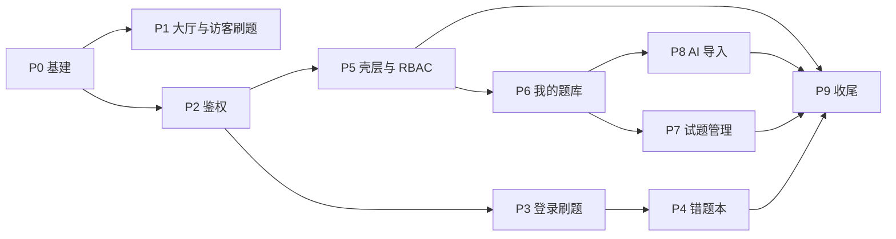

# iShua 前端分步执行方案

> **目的**：将 `docs/design/ishua-ui-spec.md` 拆解为可独立交付、可联调、可验收的实施阶段。  
> **API**：`api-docs-v3.json`（仓库根目录）  
> **设计粗稿**：`docs/design/atlas-ui-design-draft.md`（只读参考，实施以终稿为准）

---

## 1. 总览

### 1.1 目标


| 里程碑    | 用户可感知能力               |
| ------ | --------------------- |
| **M1** | 访客在大厅选题库、刷公开题（本地判分）   |
| **M2** | 注册登录；登录后刷公开题、错题本、错题重刷 |
| **M3** | PREMIUM 建库、管题、手工录题    |
| **M4** | AI 导入全流程              |
| **M5** | 权限与体验收尾；ADMIN 占位      |


### 1.2 原则

- **先后端契约、后页面**：每阶段先打通 API 封装与 `Result.code` 处理，再做 UI。
- **先主路径、后管理**：刷题闭环优先于题库 CRUD、AI 导入。
- **阶段可演示**：每阶段结束应能单独演示，不依赖未完成阶段（除明确标注的依赖）。
- **单 PR 粒度**：下表「工作包」建议一个 PR 或一个短迭代完成，便于 Code Review。

### 1.3 依赖关系




---

## 2. 前置条件


| 项    | 说明                                                       |
| ---- | -------------------------------------------------------- |
| 后端   | Atlas API 可在本地访问（默认 `http://localhost:8080`），CORS 已放行前端源 |
| 设计   | 开发前阅读 `ishua-ui-spec.md` §4（token）、§8（鉴权）、§7（对应组件）       |
| 资产   | `assets/logo/` Logo 已就绪                                  |
| 环境   | Node 18+；包管理器与团队约定一致（npm/pnpm）                           |
| 测试账号 | 至少准备：`USER`、`PREMIUM`、`ADMIN` 各一（ADMIN 用于后期占位与二期）        |


**环境变量（建议）**


| 变量                  | 示例                      | 阶段   |
| ------------------- | ----------------------- | ---- |
| `VITE_API_BASE_URL` | `http://localhost:8080` | P0 起 |


---

## 3. 分阶段执行明细

### P0 — 项目基建（阻塞后续所有阶段）

**目标**：空仓库具备统一技术栈、设计 token、API 与路由骨架。


| 工作包  | 任务                                                                | 产出                        |
| ---- | ----------------------------------------------------------------- | ------------------------- |
| P0-1 | `npm create vite` + React + TS；安装 React Router、Tailwind           | 可 `dev` 启动                |
| P0-2 | 初始化 shadcn/ui；配置 `components.json`                                | Button、Input、Dialog 等基座可用 |
| P0-3 | `src/styles/tokens.css` 注入 §4 色板与字体（Noto Serif/Sans 链接）           | 全局考纲手札基调                  |
| P0-4 | `openapi-typescript` 从 `api-docs-v3.json` 生成 `src/types/api.d.ts` | 类型与后端一致                   |
| P0-5 | `api/client.ts`：`Result<T>` 解析、`code!==200` 拒绝                    | 统一错误形态                    |
| P0-6 | 请求拦截器：白名单不加 Bearer；`ishua_token` → Header                         | 鉴权骨架                      |
| P0-7 | `router.tsx` 注册终稿 §5.1 全部路由（页面可先占位 `PageStub`）                    | 路由表完整                     |
| P0-8 | `lib/parseOptionsJson.ts`、`lib/gradeAnswer.ts` 空实现或单测占位           | 供 P1/P3 使用                |


**本阶段 API**：无业务调用，仅 client 健康检查（可选 `GET` 公开接口试连）。

**验收**

- `pnpm dev` 无报错；路由跳转正常  
- 米白底 + 墨绿主按钮可见  
- 手动设 `localStorage.ishua_token` 后，非白名单请求带 Bearer

**建议 PR**：`chore: scaffold vite react shadcn and api client`

---

### P1 — 公开大厅 + 访客刷题（里程碑 M1）

**目标**：未登录完整路径：大厅 → 访客刷题 → 完成页；**不调用 submit**。

**依赖**：P0。


| 工作包  | 任务                                                    | 组件/页面             |
| ---- | ----------------------------------------------------- | ----------------- |
| P1-1 | `api/banks.ts`：`pagePublicBanks`                      | —                 |
| P1-2 | `api/banks.ts`：`getHotPracticeDetail`                 | —                 |
| P1-3 | 简易顶栏布局（Logo、Slogan、登录/注册）                             | 大厅壳层              |
| P1-4 | 页面 `/`：`BankCard` 网格 + `Pagination`（pageSize 按断点）     | `BankCard`        |
| P1-5 | 大厅空态：文案 + Logo 淡色                                     | —                 |
| P1-6 | `GuestPracticePlayer` + `PracticeComplete`            | 刷题核心              |
| P1-7 | 页面 `/practice/guest/:bankId`；顶栏「登录以同步错题」              | —                 |
| P1-8 | `gradeAnswer` 实现：SINGLE/MULTI/JUDGE 与 `answerJson` 比对 | `lib/gradeAnswer` |


**API 覆盖**


| 方法  | 路径                                                    | 鉴权  |
| --- | ----------------------------------------------------- | --- |
| GET | `/api/v1/question-banks/public`                       | 无   |
| GET | `/api/v1/question-banks/{bankId}/hot-practice-detail` | 无   |


**验收**（对齐 `ishua-ui-spec.md` §10.2 访客部分）

- 卡片仅标题+描述；Slogan「一页一题，沉浸刷完」  
- 选题库刷题；提交后本地对错+解析  
- 完成页：统计 + 返回大厅 / 再刷一遍  
- 无随机顺序 UI

**建议 PR**：`feat: public lobby and guest practice`

**联调注意**：确认 `hot-practice-detail` 返回的 `QuestionVO` 含 `answerJson`、`analysis`。

---

### P2 — 登录注册 + Auth 状态（里程碑 M2 前半）

**目标**：注册、登录、token 持久化、按 `role` 跳转、`useAuth` 全局可用。

**依赖**：P0。


| 工作包  | 任务                                                                 | 组件/页面      |
| ---- | ------------------------------------------------------------------ | ---------- |
| P2-1 | `api/auth.ts`：login、register、me                                    | —          |
| P2-2 | `hooks/useAuth.ts`：token、user、login/logout、bootstrap 调 `me`        | —          |
| P2-3 | 401 拦截：清 token、`/login?redirect=`                                  | client 增强  |
| P2-4 | 页面 `/login`、`/register` + `AuthForm`                               | `AuthForm` |
| P2-5 | 登录成功跳转：PREMIUM+ → `/app/banks`；USER → `/` 或 `/app/wrong-questions` | —          |
| P2-6 | 大厅已登录态：顶栏昵称 + 退出；刷题链到 `/app/practice/:id`                          | —          |


**API 覆盖**


| 方法   | 路径                       |
| ---- | ------------------------ |
| POST | `/api/v1/users/register` |
| POST | `/api/v1/users/login`    |
| GET  | `/api/v1/users/me`       |


**验收**

- 注册固定 USER；409/401 文案友好  
- 刷新页面仍保持登录（me 成功）  
- 过期 token 跳转登录并带 redirect

**建议 PR**：`feat: auth login register and session`

---

### P3 — 登录刷题（题库练习）（里程碑 M2 核心）

**目标**：`/app/practice/:bankId` 完整闭环：拉题（无答案）→ submit → 解析 → 错题 Toast → 完成页。

**依赖**：P2。


| 工作包  | 任务                                                   | 组件/页面   |
| ---- | ---------------------------------------------------- | ------- |
| P3-1 | `api/practice.ts`：listPracticeQuestions、submitAnswer | —       |
| P3-2 | `hooks/usePracticeSession.ts`：题序、作答态、未答统计            | —       |
| P3-3 | `PracticePlayer`（与 Guest **独立文件**）                   | §7.11   |
| P3-4 | 刷题页 `immersive` 布局：无侧栏无底栏                            | 路由 meta |
| P3-5 | 答错 Toast 3s；主观题占位                                    | —       |
| P3-6 | 复用 `PracticeComplete`（文案「本次练习完成」）                    | —       |


**API 覆盖**


| 方法   | 路径                                                              |
| ---- | --------------------------------------------------------------- |
| GET  | `/api/v1/practice/banks/{bankId}/questions`                     |
| POST | `/api/v1/practice/banks/{bankId}/questions/{questionId}/submit` |


**验收**

- 提交前界面无标准答案  
- 单选/多选/判断均经底部「提交」  
- 可跳过未答；完成页含未答数  
- 移动端刷题无底栏

**建议 PR**：`feat: practice player with submit`

---

### P4 — 错题本 + 错题重刷（里程碑 M2 闭环）

**目标**：错题列表、筛选、移出；**独立页** `/app/wrong-questions/practice`。

**依赖**：P3（submit 会产生错题）。


| 工作包  | 任务                                      | 组件/页面 |
| ---- | --------------------------------------- | ----- |
| P4-1 | `api/wrong.ts`：page、listPractice、remove | —     |
| P4-2 | `WrongQuestionList` + 分页 + bankId 筛选    | §7.15 |
| P4-3 | 页面 `/app/wrong-questions`               | —     |
| P4-4 | `WrongPracticePlayer` **独立组件/页面**       | §7.13 |
| P4-5 | `PracticeComplete` 错题文案 + 返回错题本         | —     |


**API 覆盖**


| 方法     | 路径                                 |
| ------ | ---------------------------------- |
| GET    | `/api/v1/wrong-questions`          |
| GET    | `/api/v1/wrong-questions/practice` |
| DELETE | `/api/v1/wrong-questions/{id}`     |


**验收**

- 答错后列表可见；移出后消失  
- 重刷 URL 为 `/app/wrong-questions/practice`，非 `/app/practice`  
- 重刷仍走 submit 接口

**建议 PR**：`feat: wrong questions list and practice`

---

### P5 — AppShell、导航与 RBAC（贯穿 M2，可与 P4 并行）

**目标**：`/app/`* 统一壳层；菜单按角色；USER 触达 PREMIUM 功能弹升级。

**依赖**：P2（建议与 P3/P4 并行，但需 P2 完成）。


| 工作包  | 任务                                         | 组件/页面 |
| ---- | ------------------------------------------ | ----- |
| P5-1 | `AppShell`：桌面侧栏 + 移动底栏                     | §7.1  |
| P5-2 | 刷题路由标记 `immersive`，隐藏底栏/侧栏                 | —     |
| P5-3 | `RoleGate`：保护 `/app/banks` 等               | §7.2  |
| P5-4 | `UpgradePrompt` + 邮箱复制                     | §7.3  |
| P5-5 | 移动「我的」Sheet：昵称、升级说明、退出                     | —     |
| P5-6 | 页面 `/app/admin/users` → `AdminPlaceholder` | §7.19 |


**验收**

- USER 侧栏无「我的题库」或点击弹 Upgrade  
- PREMIUM 可见题库入口  
- ADMIN 可见管理占位  
- 发现 `/` 从 app 内可回大厅

**建议 PR**：`feat: app shell navigation and rbac`

---

### P6 — 我的题库（里程碑 M3 前半）

**目标**：PREMIUM 题库列表、新建/编辑（Drawer）、删库（输入名称确认）。

**依赖**：P5。


| 工作包  | 任务                                              | 组件/页面         |
| ---- | ----------------------------------------------- | ------------- |
| P6-1 | `api/banks.ts`：pageMyBanks、create、update、delete | —             |
| P6-2 | 页面 `/app/banks`：列表 + 公开/私有标签                    | `BankCard` 复用 |
| P6-3 | `BankForm` Drawer 新建/编辑                         | §7.6          |
| P6-4 | `DeleteBankDialog` 名称匹配                         | §7.7          |


**API 覆盖**


| 方法         | 路径                                |
| ---------- | --------------------------------- |
| GET/POST   | `/api/v1/question-banks`          |
| PUT/DELETE | `/api/v1/question-banks/{bankId}` |


**验收**

- USER 无法进入或仅见 Upgrade  
- 删库必须输入正确题库名

**建议 PR**：`feat: my question banks crud`

---

### P7 — 题库详情与试题管理（里程碑 M3）

**目标**：题库里试题分页搜索、整页新建/编辑（PUT 全量）、删题确认。

**依赖**：P6。


| 工作包  | 任务                                                     | 组件/页面 |
| ---- | ------------------------------------------------------ | ----- |
| P7-1 | `api/questions.ts`：pageInBank、create、get、update、delete | —     |
| P7-2 | 页面 `/app/banks/:bankId`：详情 + `QuestionList` + 搜索       | §7.8  |
| P7-3 | 入口：开始刷题、AI 导入、编辑题库 Drawer                              | —     |
| P7-4 | `QuestionForm` 整页 new/edit                             | §7.9  |
| P7-5 | `ConfirmDialog` 删题 + 不再提示                              | §7.16 |
| P7-6 | `TagQuestionType`                                      | §7.10 |


**API 覆盖**


| 方法             | 路径                                          |
| -------------- | ------------------------------------------- |
| GET/POST       | `/api/v1/question-banks/{bankId}/questions` |
| GET/PUT/DELETE | `/api/v1/questions/{id}`                    |


**验收**

- 编辑走 PUT 全量 `QuestionUpdateDTO`  
- optionsJson/answerJson 字符串序列化正确  
- 从详情可进入 `/app/practice/:bankId` 刷私有库

**建议 PR**：`feat: question list and form`

---

### P8 — AI 智能导入（里程碑 M4）

**目标**：四步向导：上传 → 轮询 → 表格预览编辑 → 批量确认入库。

**依赖**：P6（需已有题库 bankId）。


| 工作包  | 任务                                     | 组件/页面 |
| ---- | -------------------------------------- | ----- |
| P8-1 | `api/aiImport.ts`：submit、getTaskStatus | —     |
| P8-2 | `api/banks.ts`：batchImportQuestions    | —     |
| P8-3 | `ImportWizard` 四步状态机                   | §7.17 |
| P8-4 | `PreviewQuestionTable` 展开编辑            | §7.18 |
| P8-5 | 页面 `/app/banks/:bankId/import`         | —     |
| P8-6 | 429/409/FAILED 文案                      | —     |


**API 覆盖**


| 方法   | 路径                                                |
| ---- | ------------------------------------------------- |
| POST | `/api/v1/ai-import/submit`                        |
| GET  | `/api/v1/ai-import/tasks/{taskId}/status`         |
| POST | `/api/v1/question-banks/{bankId}/questions/batch` |


**验收**

- 轮询 2–5s，PARSED 后展示预览  
- 确认导入后详情页可见新题  
- USER 访问走 Upgrade

**建议 PR**：`feat: ai import wizard`

---

### P9 — 收尾与质量（里程碑 M5）

**目标**：全局体验、无障碍、验收清单扫尾；文档与脚本就绪。

**依赖**：P1–P8 主功能已完成。


| 工作包  | 任务                                  |
| ---- | ----------------------------------- |
| P9-1 | 全局 `ErrorState`、Toast 文案统一          |
| P9-2 | `prefers-reduced-motion` 与键盘刷题走查    |
| P9-3 | 403 页 vs Upgrade 边界复查               |
| P9-4 | README：本地启动、环境变量、测试账号说明             |
| P9-5 | 按 `ishua-ui-spec.md` §10 全量勾选验收     |
| P9-6 | 可选：关键路径 E2E（大厅 → 访客刷题；登录 → 刷题 → 错题） |


**验收**

- §10 + §11 终检项全部通过  
- 无控制台泄露访客答案

**建议 PR**：`chore: polish a11y readme and qa`

---

## 4. 并行与排期建议

### 4.1 单人顺序（推荐）

```text
P0 → P1 → P2 → P3 → P4 → P5 → P6 → P7 → P8 → P9
```

说明：`P5` 可在 **P2 完成后** 与 P3、P4 **交错**（先 minimal AppShell 供 `/app/practice` 挂载，再在 P5 补全导航与 RBAC）。

### 4.2 双人拆分


| 开发者 A        | 开发者 B             |
| ------------ | ----------------- |
| P0 → P1 → P2 | 等待 P0             |
| P3 → P4      | P5（P2 后）→ P6 → P7 |
| P8           | P9 联调             |


**汇合点**：P2 结束（鉴权约定）、P0 结束（目录与 client 约定）。

### 4.3 演示节点


| 节点     | 完成后可演示                |
| ------ | --------------------- |
| 第 1 周末 | P0+P1：访客刷题            |
| 第 2 周末 | P2+P3+P4+P5：登录刷题 + 错题 |
| 第 3 周末 | P6+P7：建库管题            |
| 第 4 周末 | P8+P9：AI 导入 + 收尾      |


（日期仅为规划占位，按实际人力调整。）

---

## 5. 明确不在本方案内（二期）


| 项                | 说明                               |
| ---------------- | -------------------------------- |
| 随机顺序             | UI 与 `random` 参数均不做；与后端存储方案对齐后再开 |
| ADMIN 用户管理       | 仅占位页；`GET/PUT admin/users` 二期再接  |
| 深色模式             | 首版无                              |
| Dashboard / 练习统计 | 无 API，不做                         |
| Cookie 鉴权        | 维持 localStorage + Bearer         |
| 试题 PATCH 局部更新    | 仅 PUT 全量                         |


---

## 6. 风险与对策


| 风险                        | 对策                                             |
| ------------------------- | ---------------------------------------------- |
| CORS / 端口不一致              | P0 用 `.env.development` 固定 `VITE_API_BASE_URL` |
| `Result.code` 与 HTTP 状态混淆 | 拦截器只认 body.code；写进 README                      |
| 访客答案泄露                    | 禁止 `console.log` 题目；Code Review 检查             |
| PREMIUM 测试账号缺失            | 联调前由 ADMIN 改角色或准备种子数据                          |
| AI 导入耗时长                  | 步骤 2 明确 loading；轮询可取消（可选优化）                    |
| 大题库一次拉全量卡顿                | 首版接受；二期可按题分页刷题（需后端）                            |


---

## 7. 文档索引


| 文档                                     | 用途             |
| -------------------------------------- | -------------- |
| `docs/design/ishua-ui-spec.md`         | UI/组件/验收唯一实施规格 |
| `docs/design/atlas-ui-design-draft.md` | 决策背景与粗稿（不随代码改） |
| `api-docs-v3.json`                     | 接口与 Schema 真源  |
| **本文** `docs/implementation-plan.md`   | 分步执行与 PR 拆分    |


---

## 8. 阶段完成检查表（总表）

复制到 Issue / 项目管理工具时，可按阶段勾选。


| 阶段           | 完成  |
| ------------ | --- |
| P0 基建        | ☐   |
| P1 大厅 + 访客刷题 | ☐   |
| P2 鉴权        | ☐   |
| P3 登录刷题      | ☐   |
| P4 错题本       | ☐   |
| P5 壳层 RBAC   | ☐   |
| P6 我的题库      | ☐   |
| P7 试题管理      | ☐   |
| P8 AI 导入     | ☐   |
| P9 收尾        | ☐   |


---

*方案版本：1.0 · 2026-05-19 · 对应 ishua-ui-spec v1.0*